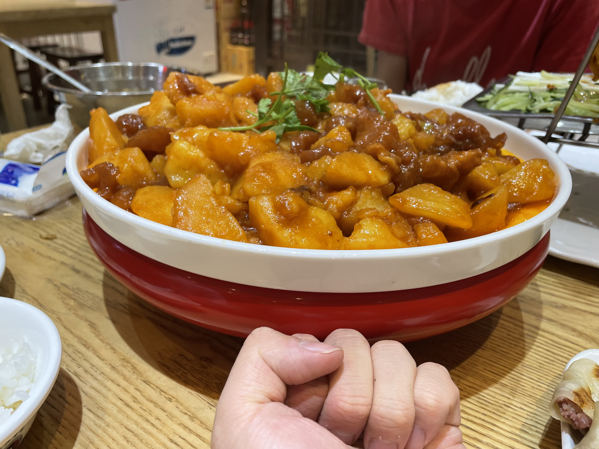
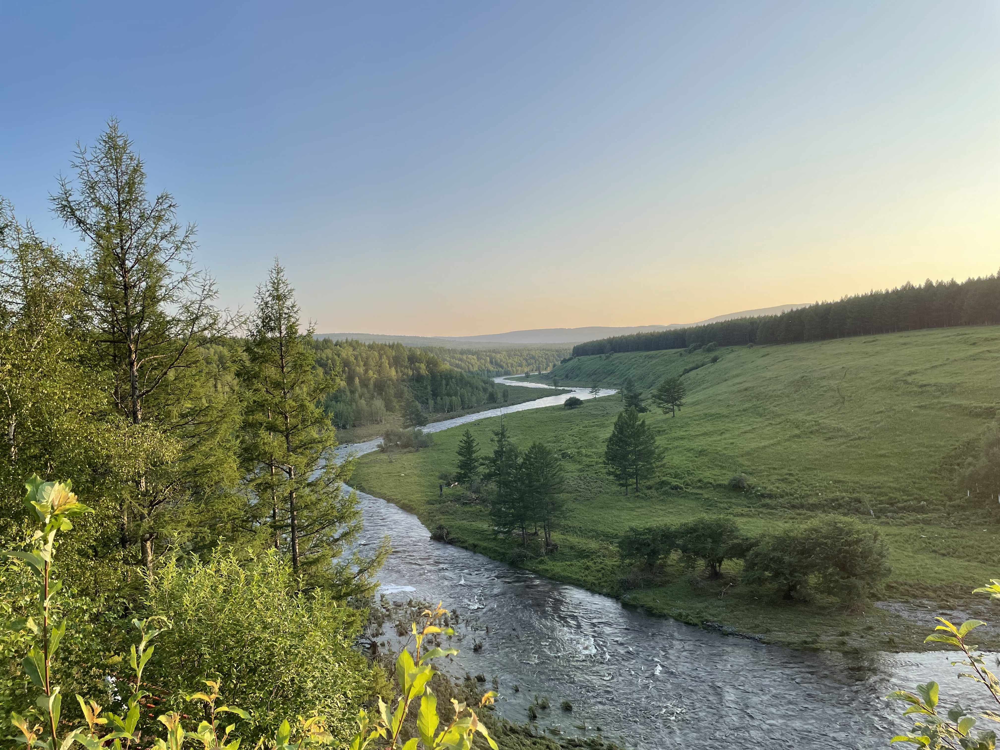
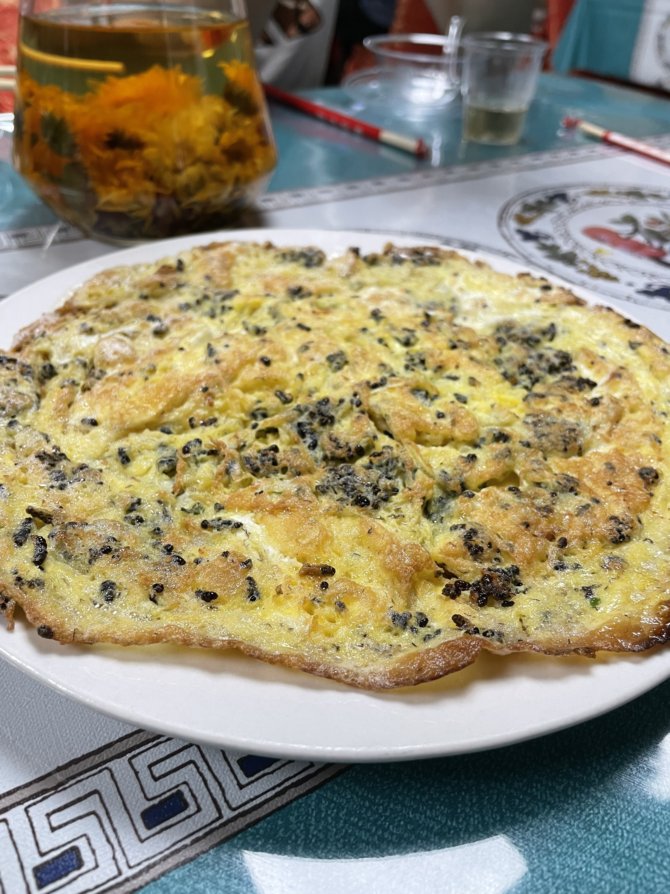
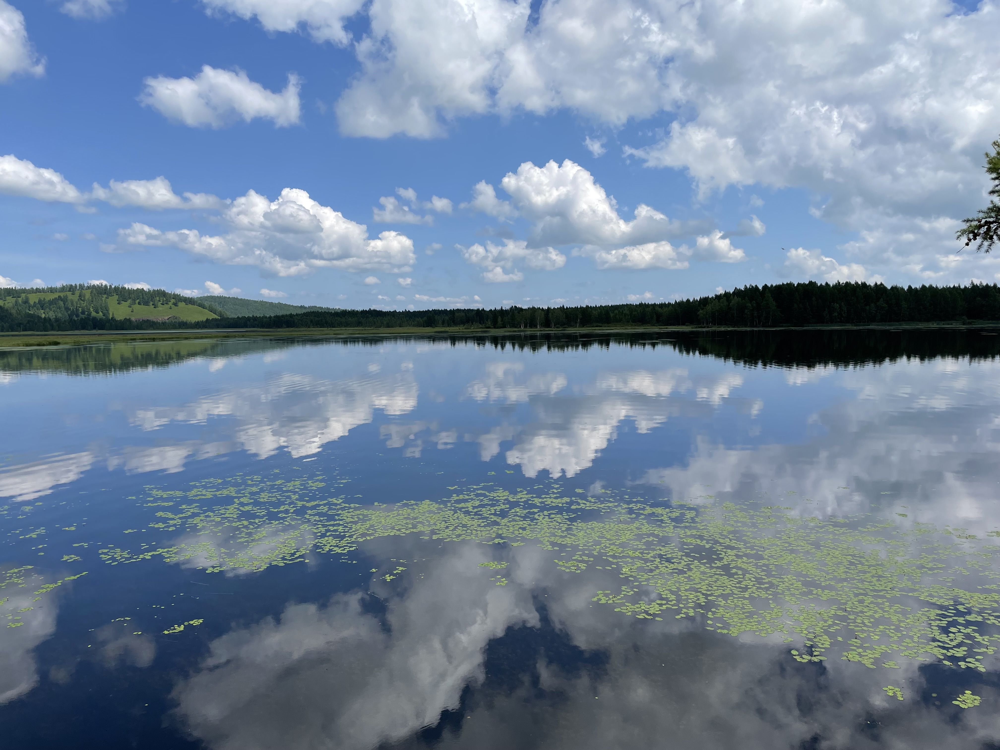
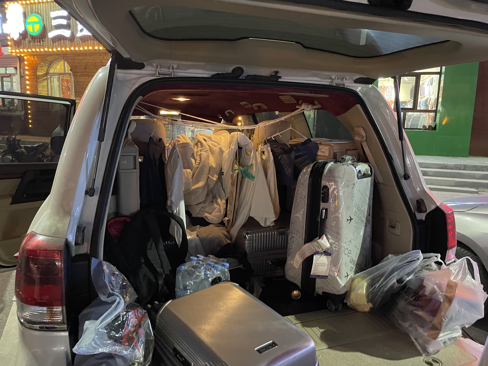
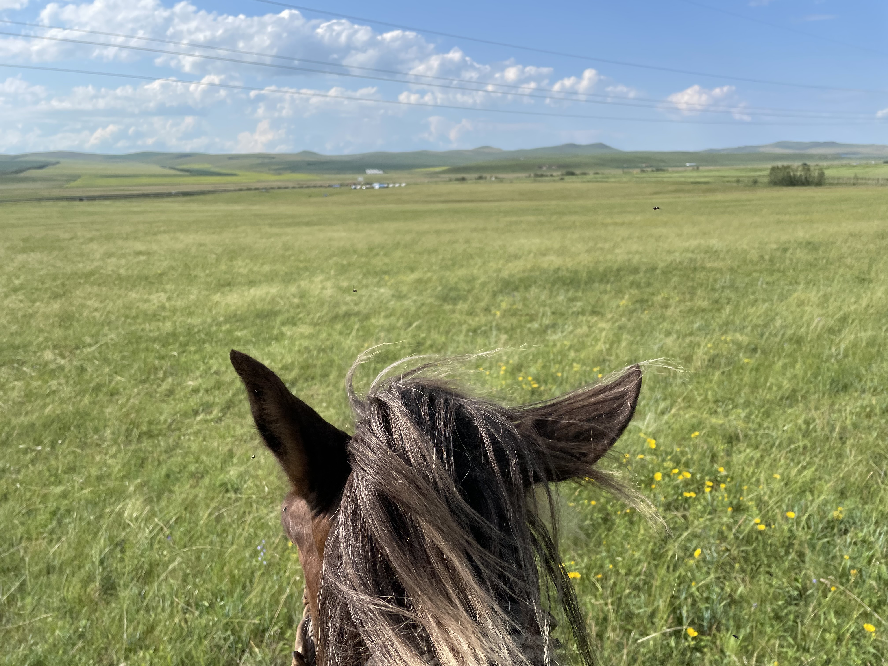
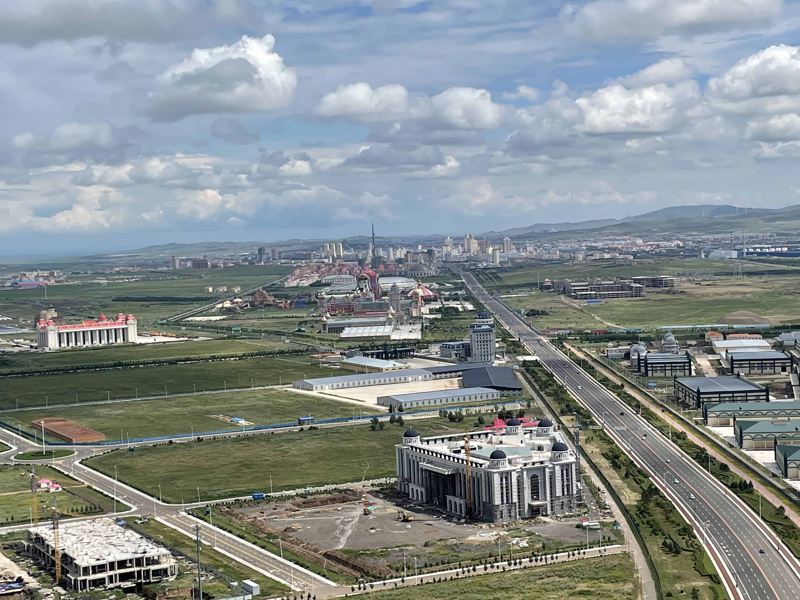



# Here are some photos of the wonderful moments!

My favorite peice in this exhibition

Rock carved with one thousand of Buddha.

Oil Well

A Big bowl!!

The River that never freeze.

Eggs with Ants. Yes, it's edible.

The Rhododendron Lake, without Rhododendron.

Our sweet portable home.

Bad News: I was forced to get quarantined, during my trip.
Good News: I was quarantined in a Mountain Villa!

I'm the king of the grassland

One step away from РОССИЯ!!

