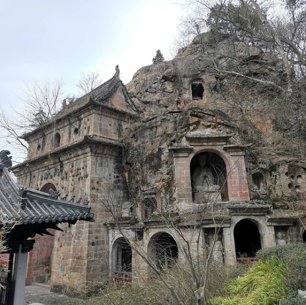
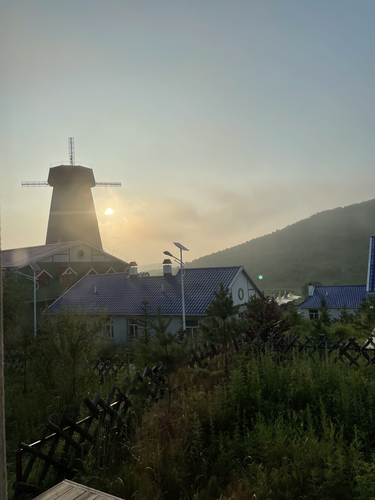
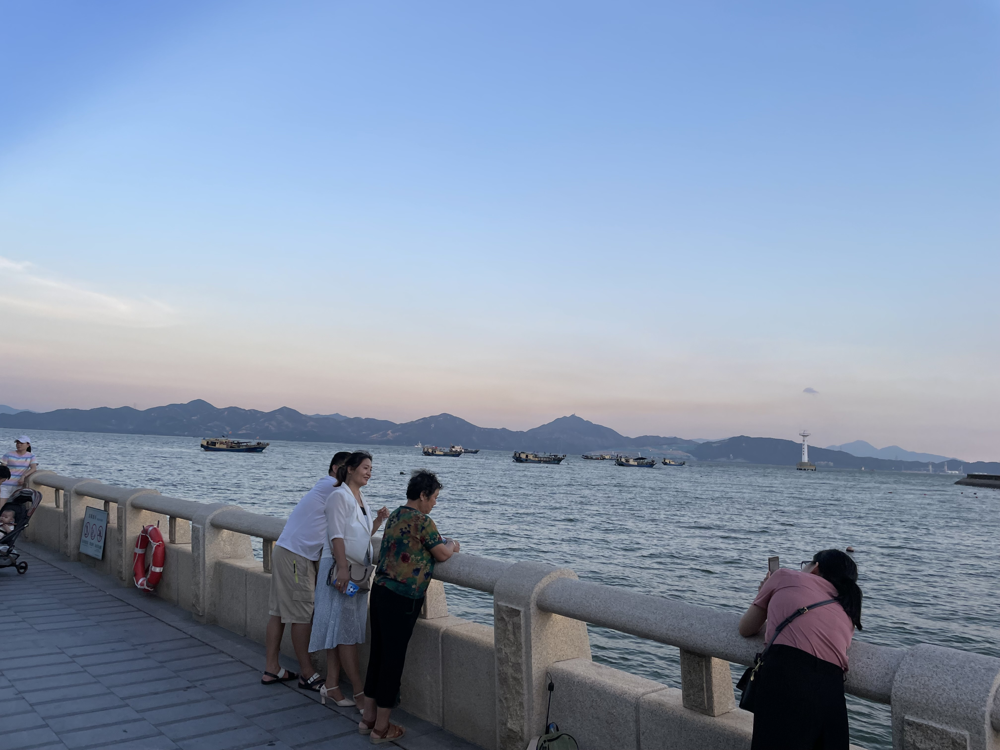



### Photos of Wonderful Moments 

I'm back to Boston again!

Me in Yosemite, ft Joyce

Me in Joshua Tree National Park

Me in Rocky Moutain National Park

Me in Hawaii

I'm in Ann Arbor!!! @Ann Arbor

My favorite peice in this exhibition @Shanghai

Rock carved with one thousand of Buddha. @Nanjing

A Big bowl!! @Zalan village

The River that never freeze.

The Rhododendron Lake without Rhododendron. @A-Er Mountain

Bad News: I was forced to get quarantined, during my trip.

Good News: I was quarantined in a Mountain Villa! @A-Er Mountain

I'm the king of the Hulunbuir

One step away from РОССИЯ!! @Manchulia

The Church of Soffia @Harbin

The Qing Palace. @Tianjin

Shenzhen is a working city, but the sea is relaxing. @Shenzhen

Doha at a glance @Doha

Not sure it's a sun rise or fall @Somewhere up in the sky, probably above Germany

Hi America! Hi Chicago! @Chicago

