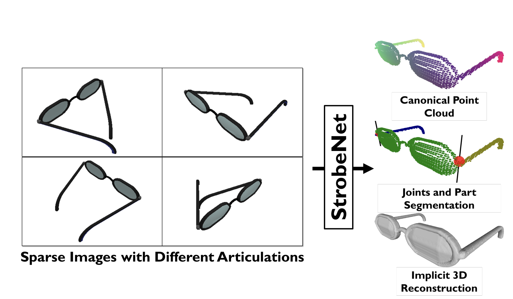

StrobeNet addresses category-level 3D reconstruction of articulated objects from one or more RGB images. Reconstructing general articulated object categories is challenging due to wide variation in shape, appearance, and topology across instances and articulation states.

Our key idea is **articulation canonicalization**: mapping object observations to a canonical articulation state, enabling correspondence-free multiview aggregation. An end-to-end trainable network estimates feature-enriched canonical 3D point clouds, articulation joints, and part segmentations from input images. These intermediate representations are then used to generate an implicit function for final shape reconstruction.

StrobeNet can reconstruct objects observed in different articulation states across images with large baselines, and produces animatable 3D models. Evaluations on our benchmark dataset demonstrate high reconstruction accuracy that improves as more views are added.

[Project website](https://dzhange.github.io/StrobeNet/)
