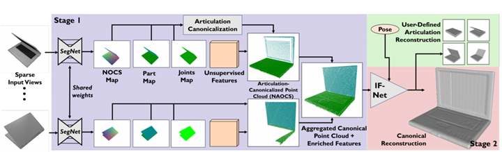

We present StrobeNet, a method for category-level 3D reconstruction of articulating objects from one or more RGB 
images. Reconstructing general articulating object categories has important applications, but is challenging since objects can have wide variation in shape, appearance and topology. We address this problem by building on the idea of category-level articulation canonicalization – mapping object observations to a canonical articulation which enables correspondence-free multiview aggregation. Our endto-end trainable neural network estimates feature-enriched canonical 3D point clouds, articulation joints, and part segmentation from one or more images. These intermediate estimates are used to generate an implicit function as the final shape reconstruction. Our approach can reconstruct objects even when they are observed in different articulations in images with large baselines, and allows reconstruction of animatable 3D models of objects. Quantitative and qualitative evaluations on our new benchmark dataset demonstrate that our method is able to achieve high reconstruction accuracy, especially as more views are added.

<!-- Download our paper [here](https://thu17cyz.github.io/files/3dioumatch.pdf) -->

Our project website is [here](https://dzhange.github.io/StrobeNet/)
