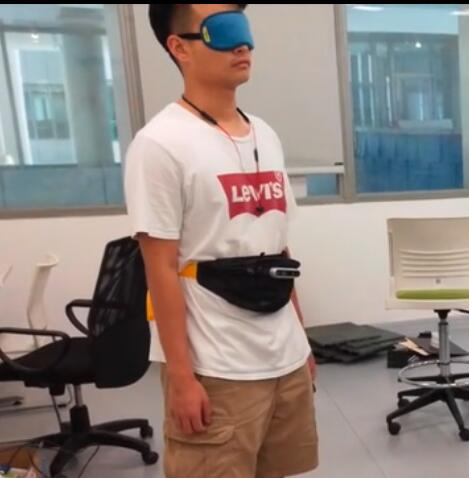

Me wearing the body pack

We designed a visual aid system, featuring path planning, navigation, and object detection to help the visually impaired in daily activities.
To accomplish this, we assembled several sensors, including RGBD camera, microphone, GPS and a Gyro, together with a microcontroller into a bodypack, enabled it to run the algorithm we designed.

See our demo [here](https://m.bilibili.com/video/BV1vx411d7TA)