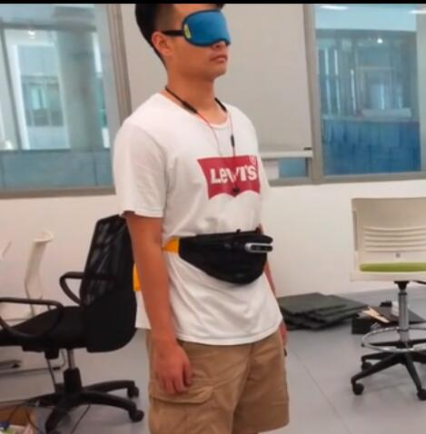

We designed a wearable visual aid system to assist visually impaired users in daily activities. The system integrates path planning, real-time navigation, and object detection into a self-contained waist pack.

The hardware combines an RGB-D camera, microphone, GPS, and gyroscope with an embedded microcontroller, running our perception and planning algorithms on-device.

[Demo video](https://m.bilibili.com/video/BV1vx411d7TA)